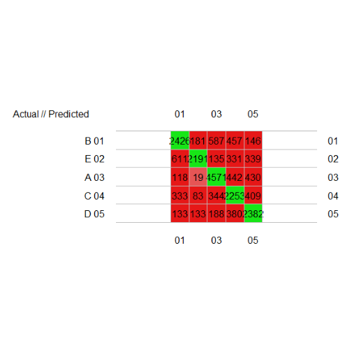
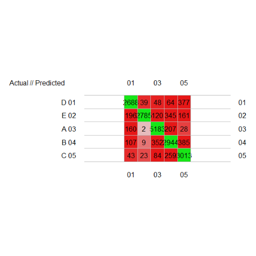
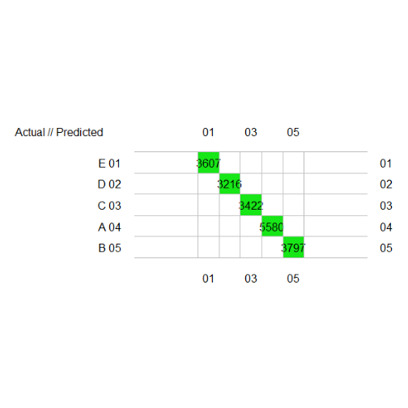

###Introduction

The data for this project comes from this source: http://groupware.les.inf.puc-rio.br/har. 6 participants were asked to perform barbell lifts correctly and incorrectly in 5 different ways and data was collected from accelerometers on the belt, forearm, arm, and dumbell attached to them. the type of lifts were classified as "classe" varying from A to E.The aim of the project is to come with a model to predict the type of lift - "classe"

The training data for this project are available here: 
https://d396qusza40orc.cloudfront.net/predmachlearn/pml-training.csv

The test data are available here: 
https://d396qusza40orc.cloudfront.net/predmachlearn/pml-testing.csv

### Data Exploration and tidying up

The training data was anayzed and was found to contain in total 160 features in it. After doing further analysis it was found that many of the columns had NA values. The following steps were done to tidy the training dataset

The following rules were considered to tidy the datasets for analysis  
- first 7 columns dropped   
- subset of new_window not equal to "yes"
- drop all columns with only NA

This resulted in a data set with 53 columns/features from the orginal dataset that had 160 columns.

### Models used

An inital analysis was done to see the correlation of the variables selected. With the results it was difficult to determine if any features are less important. A nearZeroVar was also run to check if there are variables that can be elimiated.

Two models were used to do the inital analysis using the caret package   
- lda - liner discriminant analysis   
- rf - Random forest analysis  

The first pass for lda gave an accuracy of just .7405, below the accepted value. The confusion matrix of lda models prediction on training dataset with training dataset value is shown below
 

The Randaom forest method gave an accruacy of .74 and the confusion matrix of rf model prediction on training dataset with actual value in training dataset is shown below 
 

Both models clearly showing that tuning of model was required. The rf model giving a slighlty better prediction. Analysis of the features to find importance(varImp) was done on both models and the top 20 features that impact the outcome was selected as significant variables to predict the outcome. This resulted in 31 features(including "classe") to be selected. THe features selected is shown in appendix A. Again both LDA and rf modesl were applied and the outcomes predicted.

Output of confusionMatrix using prediction from lda
 

Output of confusionMatrix using prediction from rf
 

### Conclusion
Both model showed 100% accuracy in predicting the correct outcome.


###Appendix A - Features selected

```
##             features
## 1        accel_arm_x
## 2       accel_belt_z
## 3   accel_dumbbell_x
## 4   accel_dumbbell_y
## 5   accel_dumbbell_z
## 6    accel_forearm_x
## 7    accel_forearm_z
## 8   gyros_dumbbell_y
## 9       magnet_arm_x
## 10      magnet_arm_y
## 11      magnet_arm_z
## 12     magnet_belt_y
## 13     magnet_belt_z
## 14 magnet_dumbbell_x
## 15 magnet_dumbbell_y
## 16 magnet_dumbbell_z
## 17  magnet_forearm_x
## 18  magnet_forearm_y
## 19  magnet_forearm_z
## 20         pitch_arm
## 21        pitch_belt
## 22    pitch_dumbbell
## 23     pitch_forearm
## 24          roll_arm
## 25         roll_belt
## 26     roll_dumbbell
## 27      roll_forearm
## 28   total_accel_arm
## 29          yaw_belt
## 30      yaw_dumbbell
## 31            classe
```

